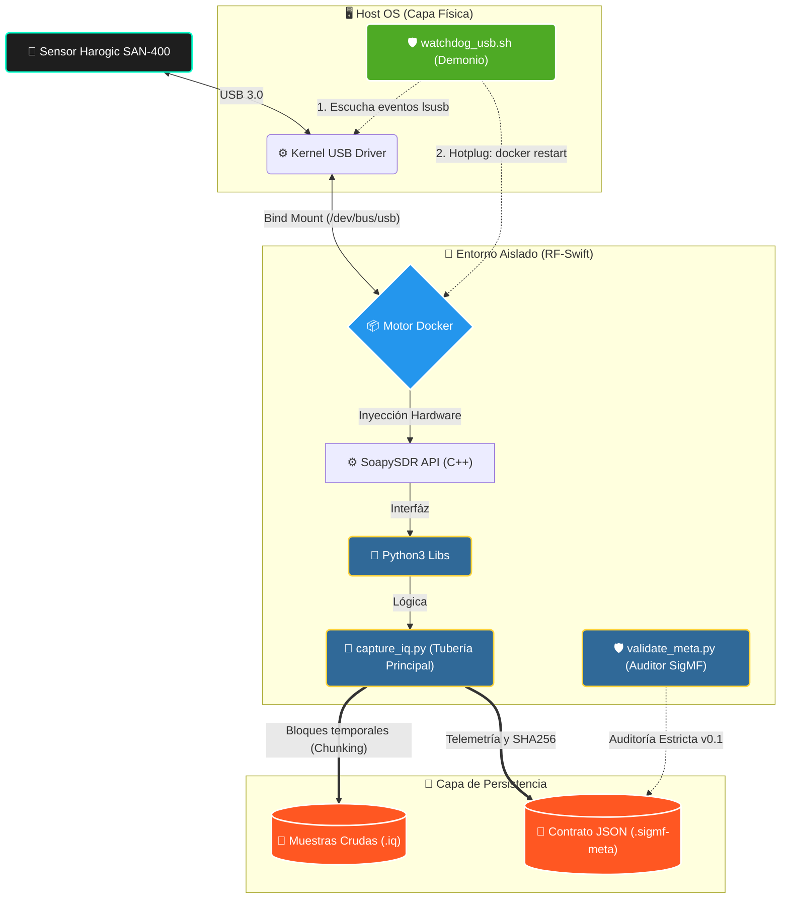

<div align="center">

  # Spectre-Horizon
  
  **Automatización y Extracción de Datos de Radiofrecuencia (IQ) para Sensores Harogic SDR.**
  
  [](https://www.python.org/)
  [](https://www.docker.com/)
  [](#)
  [](#)
  
  <br/>
  
  <br/>
  <br/>

  *Un puente de software robusto para capturar, procesar y almacenar espectro electromagnético de grado industrial utilizando Python, contenedores Docker y metadatos estándar (SigMF).*
</div>

---

## 📖 Índice

- [Resumen del Proyecto](#-resumen-del-proyecto)
- [Arquitectura Inmune a Fallos](#-arquitectura-inmune-a-fallos)
- [Requisitos de Hardware](#-requisitos-de-hardware)
- [Instalación y Despliegue](#-instalación-y-despliegue)
- [Uso y Comandos](#-uso-y-comandos)
- [Estructura de Datos (SigMF)](#-estructura-de-datos-sigmf)
- [Roadmap (Plan de 20 Días)](#-roadmap-plan-de-20-días)

---

## 🎯 Resumen del Proyecto

**Spectre-Horizon** nació de la necesidad de desvincular la captura de espectro de las interfaces gráficas pesadas y manuales (como SAStudio4 o GQRX), permitiendo una captura automatizada y parametrizable (headless).

Utilizando el entorno contenedorizado **RF-Swift**, este proyecto se comunica directamente con el hardware Harogic mediante `SoapySDR`, extrae la señal IQ pura (en formato `CF32`), y encapsula las grabaciones junto con un contrato de metadatos universal basado en el estándar **SigMF**.

---

## 🏗 Arquitectura del Sistema (Con Tolerancia a Fallos)

La solución opera bajo un modelo de capas altamente aislado para garantizar reproducibilidad y rendimiento. A partir del Día 7, se incorpora un sistema de **Hotplugging y Watchdog** en el espacio de usuario para inmunizar la ingesta de datos frente a desconexiones de hardware en caliente.

1. **Chunking (Archivos por Bloques):** Los datos se dividen en bloques temporales con su propio archivo `.sigmf-meta`. Si el sistema colapsa, solo se pierde el bloque actual.
2. **Watchdog de Espacio de Usuario:** Un demonio `bash` corre en segundo plano detectando eventos del bus mediante `lsusb`.
3. **Auto-Reconexión USB:** Si el cable se desconecta y se vuelve a conectar, el Watchdog reinicia el contenedor automáticamente para refrescar el bus USB, mientras que el script envoltorio retoma la captura sin que el proceso principal muera.



---

## ⚙️ Requisitos de Hardware

Para replicar este entorno de forma exacta, se utiliza el siguiente hardware validado:

| Componente | Especificación | Rol |
| :--- | :--- | :--- |
| **Analizador SDR** | Harogic SAN-400 / Serie 57465... | Escaneo principal de espectro electromagnético (hasta 40 GHz). |
| **Interfaz** | USB 3.0 / USB-C de Alta Velocidad | Transferencia de muestras en tiempo real sin latencia. |
| **Host** | Ubuntu Linux (Físico o Máquina Virtual) | Manejo de contenedores y alojamiento de almacenamiento masivo. |

---

## 🚀 Instalación y Despliegue

La principal ventaja de Spectre-Horizon es que no "ensucia" tu máquina local con librerías cruzadas de C++ o drivers de radio rotos. Todo funciona dentro del contenedor oficial de Penthertz.

### 1. Preparar el Entorno
Asegúrate de que el sensor Harogic esté conectado al puerto USB y lanza el contenedor con permisos al bus USB:

```bash
# Lanzar el contenedor RF-Swift en background
rfswift run -i penthertz/rfswift_noble:sdr_full -s /dev/bus/usb -u 1
```

### 2. Clonar el Repositorio
```bash
git clone https://github.com/dielectronico314/Spectre-Horizon.git
cd Spectre-Horizon
```

---

## 🛠 Uso y Comandos

El repositorio incluye un Wrapper inteligente en Bash (`scripts/capture.sh`) que no solo inyecta el comando al contenedor, sino que invoca al Watchdog de reconexión.

### Captura Rápida Resiliente
Puedes especificar la Frecuencia (Hz), Sample Rate (SPS), Ganancia (dB), Duración Total y Tamaño del Bloque (Chunking).

**Ejemplo: Capturando 3 minutos de FM, divididos en bloques de 30 segundos:**
```bash
./scripts/capture.sh --freq 106.5e6 --rate 1.953125e6 --gain 0 --duration 180 --chunk-duration 30
```

*Al finalizar (o al presionar `Ctrl+C`), los bloques se copian automáticamente del contenedor a tu escritorio local (en `rf-spectrum/data/samples/`).*

---

## 📦 Estructura de Datos (SigMF)

Para garantizar la investigación científica, por cada bloque se generan dos archivos acoplados:

1. **El archivo Binario (.iq):** Un volcado crudo de memoria con los flotantes complejos (`CF32`).
2. **El archivo de Metadatos (.sigmf-meta):** Un JSON universal con telemetría.

```json
{
    "global": {
        "core:datatype": "cf32_le",
        "core:sample_rate": 1953125.0,
        "core:hw": "Harogic SAN-400 (CalFile: Interno)",
        "core:author": "RF-Swift Automator",
        "core:version": "0.2.1",
        "core:recorder": "Spectre-Horizon Core v0.2.1",
        "core:geolocation": "Laboratorio Local",
        "core:dataset_hash": "e3b0c44298fc1c149afbf4c8996fb92427ae41e4649b934ca495991b7852b855"
    },
    "captures": [
        {
            "core:sample_start": 0,
            "core:frequency": 106500000.0,
            "core:datetime": "2026-07-23T09:30:56-04:00",
            "core:overflows": 0,
            "core:antenna": "Dipolo_Bigotes",
            "core:gain": 0.0,
            "telemetry:duration_sec": 30.0,
            "telemetry:throughput_mbps": 14.8,
            "telemetry:size_mb": 58.59
        }
    ]
}
```

---

## 🗓 Roadmap (Plan de 20 Días)

Actualmente nos encontramos en la **Fase 1** de automatización. El avance es el siguiente:

- [x] **Día 1-3:** Baseline de Hardware y Entorno Contenedorizado (RF-Swift).
- [x] **Día 4:** Detección programática de hardware con JSON API (`probe_device.py`).
- [x] **Día 5:** Bucle robusto en CF32 para capturas ininterrumpidas de espectro.
- [x] **Día 6:** Pruebas de estrés y telemetría de hardware (PSUtil).
- [x] **Día 7:** Arquitectura Inmune (Reconexión Hotplug, USB Watchdog y Chunking).
- [x] **Día 8:** Contrato Oficial de Metadata (SigMF v0.1) y Validador SHA256.
- [ ] **Día 9+:** Extracción de Eventos y Construcción del Dashboard API.

---
*Diseñado con el máximo rigor para investigación RF.*
