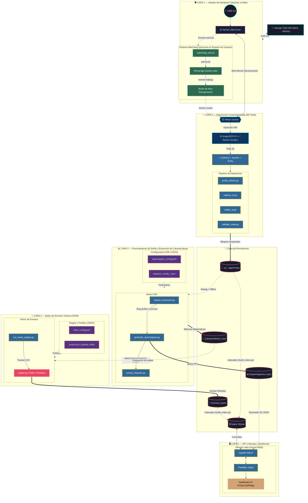

<div align="center">

  # Spectre-Horizon
  
  **Pipeline Automatizado de Conciencia Espectral para Sensores SDR Harogic.**
  
  [](https://www.python.org/)
  [](https://www.docker.com/)
  [](#)
  [](#)
  
  <br/>
  
  <br/>
  <br/>
  
  [Read this document in English](README.md)
</div>

---

## ¿Qué hace este proyecto en 20 segundos?

**Spectre-Horizon es un pipeline completo de conciencia espectral** — desde la captura de señal RF cruda hasta la generación de alertas tácticas — construido para sensores SDR Harogic operando dentro de una arquitectura basada en Docker.

Actúa como un robusto puente de software para **capturar, procesar, analizar y decidir** sobre datos del espectro electromagnético de grado industrial. Al aprovechar Python, contenedores Docker y el estándar de metadatos SigMF, desvincula por completo el flujo de trabajo SDR de las pesadas interfaces gráficas manuales, permitiendo pipelines de datos sin cabeza (headless), resilientes y parametrizables que producen inteligencia procesable — no solo gráficas bonitas.

---

## 📥 Dependencias Externas y Descargas

Este repositorio **no** contiene binarios pesados de terceros ni software del fabricante. Debes descargar las dependencias requeridas de sus fuentes oficiales:

1. **Contenedor RF-Swift (PentHertz):**
   - El entorno contenedorizado central para SDRs.
   - **Descarga/Pull:** `docker pull penthertz/rfswift_noble:sdr_full`
   - **Documentación:** [PentHertz GitHub / RF-Swift](https://github.com/PentHertz/RF-Swift)
2. **SAStudio4 y SDK de Harogic:**
   - Software oficial de Harogic y SDK C-API para el analizador de espectro SAN-400.
   - **Descarga:** [Página Oficial de Descargas de Harogic](http://www.harogic.eu/download/)
   - *Nota: Solo es necesario si deseas utilizar la interfaz gráfica o compilar tus propios controladores en C. Spectre-Horizon utiliza los controladores SoapySDR integrados dentro del contenedor RF-Swift.*

---

## ⚡ Inicio Rápido

### 1. Preparar el Entorno
Asegúrate de que tu sensor Harogic esté conectado por USB e inicia el contenedor `RF-Swift` con permisos de bus USB:
```bash
rfswift run -i penthertz/rfswift_noble:sdr_full -s /dev/bus/usb -u 1
```

### 2. Clonar el Repositorio
```bash
git clone https://github.com/dielectronico314/Spectre-Horizon.git
cd Spectre-Horizon
```

### 3. Iniciar el Sistema Completo (API + Dashboard)
Lanza todo el stack unificado de análisis (backend y frontend) con un solo comando:
```bash
bash run_demo.sh
```
El dashboard estará disponible en `http://localhost:8000/dashboard/`.

### 4. Iniciar una Captura de Espectro (Opcional)
Capturar 3 minutos de Radio FM (106.5 MHz), dividiendo la salida en fragmentos SigMF de 60 segundos:
```bash
./scripts/capture.sh \
    --freq 106.5e6 \
    --rate 1.953125e6 \
    --gain 0 \
    --duration 180 \
    --chunk-duration 60 \
    --antenna "Dipole"
```

¿Necesitas más ejemplos? Revisa la carpeta `examples/` para scripts listos para usar.

---

## 🏗 Arquitectura del Sistema

Spectre-Horizon está diseñado como un **pipeline de cuatro capas** (cinco con la API) donde cada capa está completamente desacoplada de las demás. Los datos fluyen hacia abajo desde el hardware hasta la inteligencia, mientras que la configuración fluye lateralmente a través de contratos JSON — lo que significa que **no se necesita modificar ni una sola línea de código Python** para apuntar a una nueva banda de frecuencia.


```mermaid
flowchart TB
    classDef hardware fill:#1a1a2e,stroke:#00ffcc,stroke-width:2px,color:#e0e0e0
    classDef host fill:#16213e,stroke:#e94560,stroke-width:2px,color:#e0e0e0
    classDef docker fill:#0f3460,stroke:#00b4d8,stroke-width:2px,color:#e0e0e0
    classDef python fill:#306998,stroke:#ffd43b,stroke-width:2px,color:#fff
    classDef config fill:#533483,stroke:#e94560,stroke-width:2px,color:#e0e0e0
    classDef storage fill:#1b1b2f,stroke:#ff6b6b,stroke-width:2px,color:#e0e0e0
    classDef alert fill:#e94560,stroke:#ffffff,stroke-width:2px,color:#fff
    classDef bash fill:#2d6a4f,stroke:#95d5b2,stroke-width:2px,color:#fff
    classDef web fill:#d4a373,stroke:#faedcd,stroke-width:2px,color:#000

    SENSOR["📡 Harogic SAN-400 (9kHz - 40GHz)"]:::hardware

    subgraph LAYER1["🛡️ CAPA 1 — Interfaz de Hardware Tolerante a Fallos"]
        direction TB
        USB(("🔌 USB 3.0")):::hardware
        KERNEL["⚙️ Kernel USB Driver"]:::host

        subgraph WATCHDOG["Sistema Watchdog (Demonio en Espacio de Usuario)"]
            direction LR
            WD_LISTEN["watchdog_usb.sh"]:::bash
            WD_UDEV["99-harogic-docker.rules"]:::bash
            WD_RESTART["Bucle de Auto-Recuperación"]:::bash
            WD_LISTEN -->|"poll lsusb"| WD_UDEV
            WD_UDEV -->|"evento hotplug"| WD_RESTART
        end

        USB --> KERNEL
        KERNEL -.->|"Eventos del bus"| WATCHDOG
    end

    subgraph LAYER2["🐳 CAPA 2 — Adquisición Contenedorizada (RF-Swift)"]
        direction TB
        DOCKER{{"📦 Motor Docker"}}:::docker
        SOAPY["⚙️ SoapySDR (C++ / factory harogic)"]:::docker
        PYLIBS["🐍 Python3 + NumPy + SciPy"]:::python

        subgraph ACQUISITION["Pipeline de Adquisición"]
            direction LR
            PROBE["probe_device.py"]:::python
            CAPTURE["capture_iq.py"]:::python
            REPLAY["replay_iq.py"]:::python
            VALIDATE["validate_meta.py"]:::python
        end

        DOCKER -->|"Inyección HW"| SOAPY
        SOAPY -->|"Flujo IQ"| PYLIBS
        PYLIBS --> ACQUISITION
    end

    subgraph LAYER3["📊 CAPA 3 — Procesamiento de Señal y Extracción de Características"]
        direction TB

        subgraph DSP["Motor DSP"]
            direction LR
            STREAM["stream_processor.py"]:::python
            SPECTRO["generate_spectrogram.py"]:::python
            FEATURES["extract_features.py"]:::python
            STREAM -->|"Ring Buffer Lock-free"| SPECTRO
            SPECTRO -->|"Matriz Espectrograma (.npz)"| FEATURES
        end

        subgraph DSP_CONFIG["Configuración DSP (JSON)"]
            direction LR
            SPEC_CFG["spectrogram_config.json"]:::config
            FEAT_CFG["features_config_*.json"]:::config
        end

        DSP_CONFIG -.->|"Parámetros"| DSP
    end

    subgraph LAYER4["🚨 CAPA 4 — Motor de Eventos Tácticos (FSM)"]
        direction TB

        subgraph ENGINE["Motor de Eventos"]
            direction LR
            FSM["engine.py (FSM 4 Estados)"]:::alert
            RUNNER["run_event_engine.py"]:::python
            RUNNER -->|"Tramas CSV"| FSM
        end

        subgraph RULES["Reglas y Perfiles (JSON)"]
            direction LR
            RULES_CFG["rules_config.json"]:::config
            PROFILES["continuous | packet_traffic"]:::config
        end

        RULES -.->|"Políticas"| ENGINE
    end

    subgraph LAYER5["🖥️ CAPA 5 — API Unificada y Dashboard"]
        direction TB
        subgraph WEB["Servidor Web (Puerto 8000)"]
            direction LR
            API["FastAPI REST"]:::python
            JINJA["Plantillas Jinja2"]:::python
            DASH["Dashboard UI (HTML/JS/Plotly)"]:::web
            API <--> JINJA
            JINJA --> DASH
        end
    end

    subgraph PERSISTENCE["💾 Capa de Persistencia"]
        direction LR
        RAW[("📁 .iq / .sigmf-meta")]:::storage
        NPZ[("📊 Espectrograma (.npz)")]:::storage
        CSV[("📄 Características (.csv)")]:::storage
        EVENTS[("🚨 Eventos (.json)")]:::storage
        SQLITE[("🗄️ Índice SQLite")]:::storage
    end

    SENSOR <-->|"USB 3.0"| LAYER1
    WD_RESTART -.->|"docker restart"| DOCKER
    KERNEL <-->|"Bind Mount (/dev/bus/usb)"| DOCKER
    ACQUISITION ==>|"Bloques temporales"| RAW
    RAW -.->|"Replay / Offline"| DSP
    DSP ==>|"Métricas Matemáticas"| CSV
    SPECTRO ==>|"Matriz FFT"| NPZ
    CSV -.->|"Evaluación de reglas"| ENGINE
    FSM ==>|"Alertas Filtradas"| EVENTS
    EVENTS -.->|"Indexador (build_index.py)"| SQLITE
    RAW -.->|"Indexador (build_index.py)"| SQLITE
    SQLITE <-->|"Consultas"| API
    NPZ -.->|"Diezmado 3D JSON"| API
```

### Resumen Capa por Capa

| Capa | Propósito | Componentes Clave | Día |
|:---:|:---|:---|:---:|
| **1** | **Hardware Tolerante a Fallos** — Inmuniza la captura contra desconexiones USB y fallos eléctricos. | `watchdog_usb.sh`, `99-harogic-docker.rules`, `capture.sh` | 5-7 |
| **2** | **Adquisición Contenedorizada** — Captura datos IQ crudos dentro de Docker con contratos de metadatos SigMF y hashes SHA256 de integridad. | `capture_iq.py`, `validate_meta.py`, `probe_device.py` | 1-8 |
| **3** | **DSP y Extracción de Características** — Genera espectrogramas (FFT) y extrae métricas físicas (SNR, potencia, ancho de banda) por trama. | `stream_processor.py`, `extract_features.py`, `features_config_*.json` | 9-13 |
| **4** | **Motor de Eventos Tácticos** — Una FSM determinista que convierte métricas crudas en alertas consolidadas con severidad, confianza y lógica anti-fragmentación. | `engine.py`, `run_event_engine.py`, `rules_config.json` | 14 |
| **5** | **API Unificada y Dashboard Web** — Proporciona una interfaz REST en un solo puerto y un dashboard Jinja2 renderizado en el servidor para explorar sesiones, eventos y evidencia. | `app/api/main.py`, `app/dashboard/main.py`, `run_demo.sh` | 15-19 |

---

## 🛡️ Watchdog y Tolerancia a Fallos (Detalle)

Uno de los subsistemas más críticos es el **Watchdog en Espacio de Usuario**, que opera fuera del contenedor Docker para garantizar la resiliencia del hardware:

```
┌──────────────────────────────────────────────────┐
│                HOST OS (Bare Metal)               │
│                                                   │
│   ┌───────────────┐     ┌──────────────────────┐  │
│   │ watchdog_usb.sh│────▶│ 99-harogic-docker    │  │
│   │ (Bucle Demonio)│     │ .rules (udev)        │  │
│   └───────┬───────┘     └──────────────────────┘  │
│           │                                        │
│           │  ¿Desconexión USB detectada?            │
│           │  SÍ ──▶ docker restart harogic_final   │
│           │  ──▶ capture.sh relanza el pipeline    │
│           │                                        │
│   ┌───────▼────────────────────────────────────┐   │
│   │         Contenedor Docker (RF-Swift)        │   │
│   │   SoapySDR ──▶ capture_iq.py ──▶ .iq files │   │
│   └─────────────────────────────────────────────┘   │
└──────────────────────────────────────────────────────┘
```

**¿Por qué importa?** En despliegues de campo, los cables USB se desconectan, el voltaje fluctúa y los sensores se sobrecalientan. Sin el Watchdog, cualquier desconexión mata la sesión de captura entera. Con él, el sistema **se auto-repara** en segundos y retoma la captura del tiempo restante — sin intervención humana.

---

## 📦 Estructura de Datos (SigMF)

Para garantizar estándares de investigación científica, por cada bloque se generan dos archivos acoplados:
1. **Archivo Binario (.iq):** Volcado crudo de memoria con flotantes complejos (`CF32` o `CI16`).
2. **Archivo de Metadatos (.sigmf-meta):** JSON universal con telemetría de hardware, hashes SHA256 de custodia de datos y parámetros de señal.

Para la especificación completa del esquema SigMF v0.1 y el diccionario de datos, lee `docs/CONTRATO_METADATA.md`.

---

## 🗂 Estructura del Proyecto

```
Spectre-Horizon/
├── app/
│   ├── events/
│   │   └── engine.py              # FSM: motor de eventos tácticos (4 estados)
│   └── processing/
│       └── features.py            # Matemáticas DSP (potencia, SNR, picos)
├── config/
│   ├── features_config_*.json     # Parámetros de extracción por banda
│   ├── rules_config.json          # Políticas de decisión del motor de eventos
│   └── spectrogram_config.json    # Parámetros FFT/espectrograma
├── scripts/
│   ├── capture_iq.py              # Pipeline principal de adquisición IQ
│   ├── stream_processor.py        # Procesador FFT streaming en tiempo real
│   ├── extract_features.py        # CLI de extracción de características DSP
│   ├── run_event_engine.py        # CLI del motor de eventos
│   ├── validate_meta.py           # Auditor de metadatos SigMF
│   ├── probe_device.py            # Detección de hardware (salida JSON)
│   ├── watchdog_usb.sh            # Demonio de hotplug USB
│   └── capture.sh                 # Wrapper de captura resiliente
├── tests/
│   ├── test_events_known.py       # Tests oráculo del motor de eventos (A-F)
│   ├── test_features_known.py     # Tests de regresión de extracción DSP
│   └── golden/                    # Salidas esperadas deterministas
├── docs/
│   ├── TABLERO_20_DIAS.md         # Tablero de progreso de 20 días
│   ├── EVENTS_REF.md              # Manual de referencia del motor de eventos
│   ├── FEATURES_REF.md            # Referencia de extracción de características
│   ├── ESPECTROGRAMA_REF.md       # Referencia del algoritmo de espectrograma
│   ├── CONTRATO_METADATA.md       # Especificación del esquema SigMF v0.1
│   └── BACKLOG.md                 # Deuda técnica y trabajo futuro
└── README.md
```

---

## 🗓 Roadmap (Plan de 20 Días)

Actualmente en **Fase 3** (Eventos e Inteligencia). Progreso:

- [x] **Día 1-3:** Baseline de Hardware y Entorno Contenedorizado (RF-Swift).
- [x] **Día 4:** Detección Programática de Hardware con JSON API.
- [x] **Día 5:** Bucle Robusto en CF32 para Capturas Ininterrumpidas.
- [x] **Día 6:** Pruebas de Estrés y Telemetría de Hardware (PSUtil).
- [x] **Día 7:** Arquitectura Inmune (Reconexión Hotplug, USB Watchdog y Chunking).
- [x] **Día 8:** Contrato Oficial de Metadata (SigMF v0.1) y Validador SHA256.
- [x] **Día 9:** Replay Offline Determinista de Capturas IQ.
- [x] **Día 10:** Prueba de Aceptación de Adquisición de 60 Minutos.
- [x] **Día 11:** Generación Offline de Espectrograma (Algoritmo FFT de Referencia).
- [x] **Día 12:** Pipeline de Streaming FFT en Tiempo Real (Ring Buffer Lock-free).
- [x] **Día 13:** Extracción de Características DSP (Potencia, SNR, Ancho de Banda por trama).
- [x] **Día 14:** Motor de Eventos Lógico Determinista (FSM para alertas tácticas).
- [x] **Día 15:** Empaquetado de Evidencia con hashes de integridad.
- [x] **Día 16:** API REST para consulta de sesiones y eventos (FastAPI).
- [x] **Día 17:** Dashboard Web Mínimo (Waterfall + Tabla de Alertas).
- [x] **Día 18:** Generación Automatizada de Reportes de Sesión (HTML/PDF).
- [x] **Día 19:** Unificación del Sistema, Purga de Base de Datos y Ensayo General.
- [ ] **Día 20:** Aceptación Formal, Demo en Vivo e Informe Final.

---
*Diseñado con el máximo rigor para investigación RF.*
