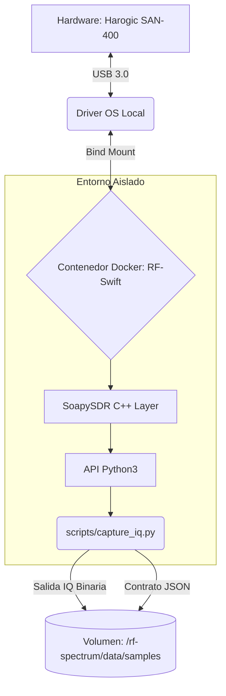

<div align="center">

  # Spectre-Horizon
  
  **Automatización y Extracción de Datos de Radiofrecuencia (IQ) para Sensores Harogic SDR.**
  
  [](https://www.python.org/)
  [](https://www.docker.com/)
  [](#)
  [](#)
  
  <br/>
  
  <br/>
  <br/>

  *Un puente de software robusto para capturar, procesar y almacenar espectro electromagnético de grado industrial utilizando Python, contenedores Docker y metadatos estándar (SigMF).*
</div>

---

## 📖 Índice

- [Resumen del Proyecto](#-resumen-del-proyecto)
- [Arquitectura del Sistema](#-arquitectura-del-sistema)
- [Requisitos de Hardware](#-requisitos-de-hardware)
- [Instalación y Despliegue](#-instalación-y-despliegue)
- [Uso y Comandos](#-uso-y-comandos)
- [Estructura de Datos (SigMF)](#-estructura-de-datos-sigmf)
- [Roadmap (Plan de 20 Días)](#-roadmap-plan-de-20-días)

---

## 🎯 Resumen del Proyecto

**Spectre-Horizon** nació de la necesidad de desvincular la captura de espectro de las interfaces gráficas pesadas y manuales (como SAStudio4 o GQRX), permitiendo una captura automatizada y parametrizable (headless).

Utilizando el entorno contenedorizado **RF-Swift**, este proyecto se comunica directamente con el hardware Harogic mediante `SoapySDR`, extrae la señal IQ pura (en formato `CF32`), y encapsula las grabaciones junto con un contrato de metadatos universal basado en el estándar **SigMF**.

---

## 🏗 Arquitectura del Sistema

La solución opera bajo un modelo de capas altamente aislado para garantizar reproducibilidad y rendimiento:



---

## ⚙️ Requisitos de Hardware

Para replicar este entorno de forma exacta, se utiliza el siguiente hardware validado:

| Componente | Especificación | Rol |
| :--- | :--- | :--- |
| **Analizador SDR** | Harogic SAN-400 / Serie 57465... | Escaneo principal de espectro electromagnético (hasta 40 GHz). |
| **Interfaz** | USB 3.0 / USB-C de Alta Velocidad | Transferencia de muestras en tiempo real sin latencia. |
| **Host** | Ubuntu Linux (Físico o Máquina Virtual) | Manejo de contenedores y alojamiento de almacenamiento masivo. |

---

## 🚀 Instalación y Despliegue

La principal ventaja de Spectre-Horizon es que no "ensucia" tu máquina local con librerías cruzadas de C++ o drivers de radio rotos. Todo funciona dentro del contenedor oficial de Penthertz.

### 1. Preparar el Entorno
Asegúrate de que el sensor Harogic esté conectado al puerto USB y lanza el contenedor con permisos al bus USB:

```bash
# Lanzar el contenedor RF-Swift en background
rfswift run -i penthertz/rfswift_noble:sdr_full -s /dev/bus/usb -u 1
```

### 2. Clonar el Repositorio
```bash
git clone https://github.com/dielectronico314/Spectre-Horizon.git
cd Spectre-Horizon
```

---

## 🛠 Uso y Comandos

El repositorio incluye "Wrappers" inteligentes en Bash (`scripts/capture.sh`) que inyectan tu comando local directamente al contenedor sin que tengas que entrar a él manualmente.

### Captura Rápida Parametrizable
Puedes especificar la Frecuencia (Hz), Sample Rate (SPS), Ganancia (dB) y Duración (Segundos).

**Ejemplo: Capturando 60 segundos de una Radio FM local (107.3 MHz):**
```bash
./scripts/capture.sh --freq 107.3e6 --rate 1.953125e6 --gain 0 --duration 60
```

**Salida en consola esperada:**
```text
==================================================
 📡 INICIANDO CAPTURA IQ PARAMETRIZADA (Paso 1)
==================================================
🔌 [Paso 2] Conectando al Harogic SDR y aplicando configuración...
✅ Hardware configurado exitosamente. Sample Rate real: 1.9531 MSPS
🌊 [Paso 3] Abriendo la tubería de datos bidireccional (Stream)...
💾 [Paso 4] Iniciando captura de 60.0 segundos...
==================================================
✅ CAPTURA FINALIZADA
Muestras  : 117,276,672
Overflows : 0
Tamaño IQ : 894.75 MB
Tiempo real: 60.03 segundos
==================================================
📝 [Paso 5] Generando contrato de metadatos (SigMF)...
```

*Al finalizar, los datos gigantescos se copian automáticamente del contenedor a tu escritorio local (en `rf-spectrum/data/samples/`).*

---

## 📦 Estructura de Datos (SigMF)

Para garantizar la investigación científica, los datos no se guardan sueltos. Por cada captura se generan dos archivos acoplados:

1. **El archivo Binario (.iq):** Un volcado crudo de memoria con los flotantes complejos (`CF32`).
2. **El archivo de Metadatos (.sigmf-meta):** Un JSON universal.

```json
{
    "global": {
        "core:datatype": "cf32_le",
        "core:sample_rate": 1953125.0,
        "core:hw": "Harogic SDR",
        "core:author": "RF-Swift Automator"
    },
    "captures": [
        {
            "core:sample_start": 0,
            "core:frequency": 107300000.0,
            "core:datetime": "2026-07-20T15:50:56.12345Z",
            "core:overflows": 0
        }
    ]
}
```

---

## 🗓 Roadmap (Plan de 20 Días)

Actualmente nos encontramos en la **Fase 1** de automatización. El avance es el siguiente:

- [x] **Día 1-3:** Baseline de Hardware y Entorno Contenedorizado (RF-Swift).
- [x] **Día 4:** Detección programática de hardware con JSON API (`probe_device.py`).
- [x] **Día 5:** Bucle robusto en CF32 para capturas ininterrumpidas de espectro con Metadatos SigMF.
- [ ] **Día 6:** Primer escaneo en banda Wi-Fi (2.4 GHz).
- [ ] **Día 7+:** Automatización de eventos y Replay de espectro.

---
*Diseñado con el máximo rigor para investigación RF.*
