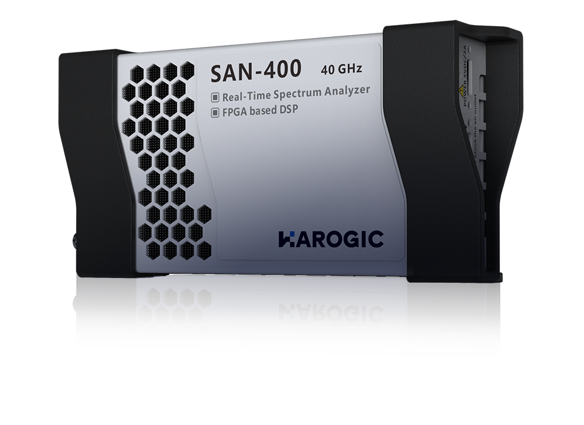
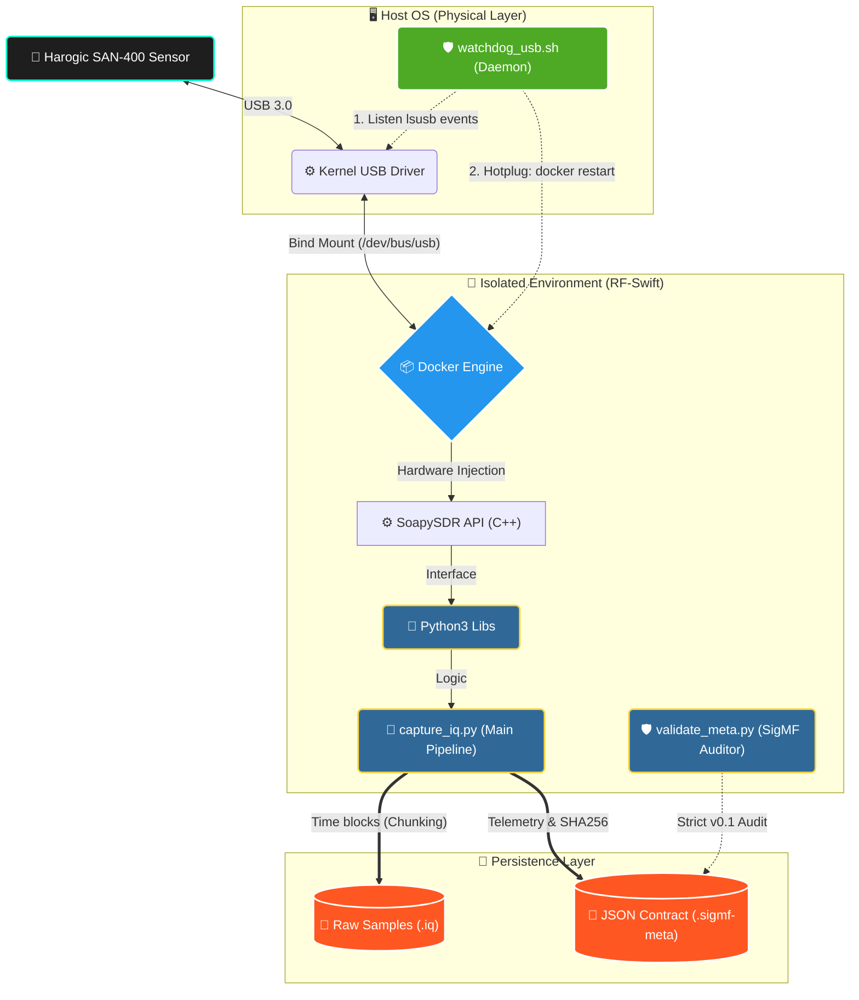

<div align="center">

  # Spectre-Horizon
  
  **Automated Radio Frequency (IQ) Data Extraction for Harogic SDR Sensors.**
  
  [](https://www.python.org/)
  [](https://www.docker.com/)
  [](#)
  [](#)
  
  <br/>
  
  <br/>
  <br/>
  
  [Lea este documento en Español](README.es.md)
</div>

---

## What does this project do in 20 seconds?

**Spectre-Horizon automates the acquisition of IQ samples from Harogic SDR sensors and stores them in SigMF format using a highly reproducible Docker-based architecture.**

It acts as a robust software bridge to capture, process, and store industrial-grade electromagnetic spectrum data. By leveraging Python, Docker containers, and the SigMF metadata standard, it completely detaches the SDR capture process from heavy manual GUIs, enabling headless, resilient, and parametrizable data pipelines.

---

## 📥 External Dependencies & Downloads

Since this repository is highly optimized, it does **not** contain heavy third-party binaries or manufacturer software. You must download the required dependencies from their official sources:

1. **RF-Swift Container (PentHertz):**
   - The core containerized environment for SDRs.
   - **Download/Pull:** `docker pull penthertz/rfswift_noble:sdr_full`
   - **Documentation:** [PentHertz GitHub / RF-Swift](#) *(Replace with actual URL if available)*
2. **SAStudio4 & Harogic SDK:**
   - Harogic's official software and C-API SDK for the SAN-400 spectrum analyzer.
   - **Download:** [Harogic Official Downloads Page](http://www.harogic.eu/download/)
   - *Note: Only required if you wish to use the graphical interface or compile your own C drivers. Spectre-Horizon uses the embedded SoapySDR drivers inside the RF-Swift container.*

---

## ⚡ Quick Start

### 1. Launch the Environment
Ensure your Harogic sensor is connected via USB and launch the `RF-Swift` container with USB bus permissions:
```bash
rfswift run -i penthertz/rfswift_noble:sdr_full -s /dev/bus/usb -u 1
```

### 2. Clone the Repository
```bash
git clone https://github.com/dielectronico314/Spectre-Horizon.git
cd Spectre-Horizon
```

### 3. Start a Resilient Capture
Capture 3 minutes of FM Radio (106.5 MHz), dividing the output into 60-second SigMF chunks:
```bash
./scripts/capture.sh \
    --freq 106.5e6 \
    --rate 1.953125e6 \
    --gain 0 \
    --duration 180 \
    --chunk-duration 60 \
    --antenna "Dipole"
```

Need more examples? Check the `examples/` directory for ready-to-use scripts.

---

## 🏗 Architecture & Fault Tolerance

The solution operates under a highly isolated layer model to guarantee reproducibility. It incorporates a **Hotplugging and Watchdog** system in userspace to immunize data ingestion against hot hardware disconnections.

1. **Chunking:** Data is split into time blocks, each with its own `.sigmf-meta` contract. If the system collapses, only the current block is lost.
2. **Userspace Watchdog:** A background bash daemon monitors USB bus events.
3. **Auto-Recovery:** If the USB cable is disconnected and reconnected, the Watchdog restarts the container automatically to refresh the `/dev/bus/usb` mapping.



---

## 📦 Data Structure (SigMF)

To guarantee scientific research standards, two coupled files are generated per block:
1. **Binary File (.iq):** A raw memory dump containing complex floats (`CF32`).
2. **Metadata File (.sigmf-meta):** A universal JSON containing hardware telemetry, SHA256 hashes for data custody, and signal parameters.

For the full SigMF v0.1 Schema specification and data dictionary, read `docs/CONTRATO_METADATA.md`.

---

## 🗓 Roadmap (20-Day Plan)

Currently in **Phase 1** (Automation). Progress:
- [x] **Day 1-3:** Hardware Baseline & Containerized Environment (RF-Swift).
- [x] **Day 4:** Programmatic Hardware Detection via JSON API.
- [x] **Day 5:** Robust CF32 event loop for uninterrupted spectrum capture.
- [x] **Day 6:** Stress tests & hardware telemetry (PSUtil).
- [x] **Day 7:** Immune Architecture (Hotplug Recovery, USB Watchdog, and Chunking).
- [x] **Day 8:** Official Metadata Contract (SigMF v0.1) & SHA256 Validator.
- [ ] **Day 9+:** Event Extraction and Dashboard API Construction.

---
*Designed with maximum rigor for RF research.*
