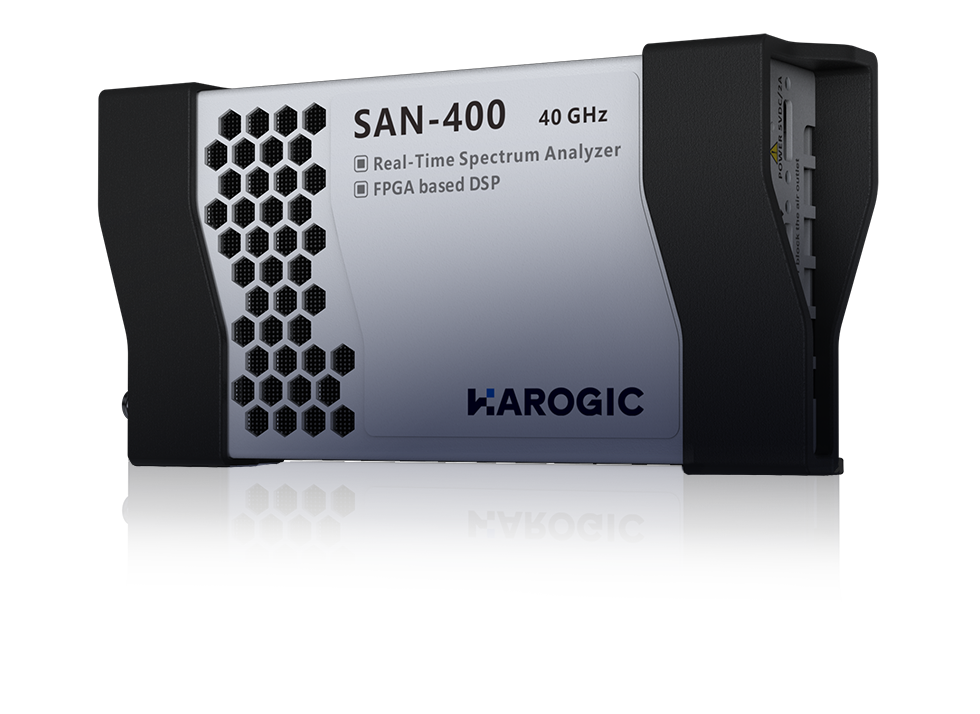
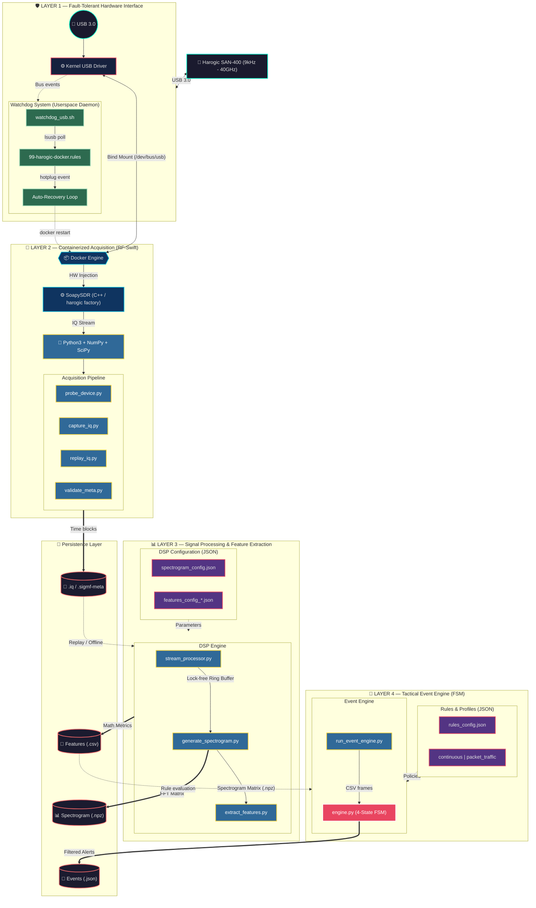

<div align="center">

  # Spectre-Horizon
  
  **Automated Spectrum Awareness Pipeline for Harogic SDR Sensors.**
  
  [](https://www.python.org/)
  [](https://www.docker.com/)
  [](#)
  [](#)
  
  <br/>
  
  <br/>
  <br/>
  
  [Lea este documento en Español](README.es.md)
</div>

---

## What does this project do in 20 seconds?

**Spectre-Horizon is a complete spectrum awareness pipeline** — from raw RF signal capture to tactical alert generation — built for Harogic SDR sensors running inside a Docker-based architecture.

It acts as a robust software bridge to **capture, process, analyze, and decide** on industrial-grade electromagnetic spectrum data. By leveraging Python, Docker containers, and the SigMF metadata standard, it completely detaches the SDR workflow from heavy manual GUIs, enabling headless, resilient, and parametrizable data pipelines that produce actionable intelligence — not just pretty graphs.

---

## 📥 External Dependencies & Downloads

This repository does **not** contain heavy third-party binaries or manufacturer software. You must download the required dependencies from their official sources:

1. **RF-Swift Container (PentHertz):**
   - The core containerized environment for SDRs.
   - **Download/Pull:** `docker pull penthertz/rfswift_noble:sdr_full`
   - **Documentation:** [PentHertz GitHub / RF-Swift](https://github.com/PentHertz/RF-Swift)
2. **SAStudio4 & Harogic SDK:**
   - Harogic's official software and C-API SDK for the SAN-400 spectrum analyzer.
   - **Download:** [Harogic Official Downloads Page](http://www.harogic.eu/download/)
   - *Note: Only required if you wish to use the graphical interface or compile your own C drivers. Spectre-Horizon uses the embedded SoapySDR drivers inside the RF-Swift container.*

---

## ⚡ Quick Start

### 1. Launch the Environment
Ensure your Harogic sensor is connected via USB and launch the `RF-Swift` container with USB bus permissions:
```bash
rfswift run -i penthertz/rfswift_noble:sdr_full -s /dev/bus/usb -u 1
```

### 2. Clone the Repository
```bash
git clone https://github.com/dielectronico314/Spectre-Horizon.git
cd Spectre-Horizon
```

### 3. Start a Resilient Capture
Capture 3 minutes of FM Radio (106.5 MHz), dividing the output into 60-second SigMF chunks:
```bash
./scripts/capture.sh \
    --freq 106.5e6 \
    --rate 1.953125e6 \
    --gain 0 \
    --duration 180 \
    --chunk-duration 60 \
    --antenna "Dipole"
```

Need more examples? Check the `examples/` directory for ready-to-use scripts.

---

## 🏗 Architecture & System Design

Spectre-Horizon is designed as a **four-layer pipeline** where each layer is fully decoupled from the others. Data flows downward from hardware to intelligence, while configuration flows laterally through JSON contracts — meaning **zero Python code changes** are needed to target a new frequency band.


```mermaid
flowchart TB
    classDef hardware fill:#1a1a2e,stroke:#00ffcc,stroke-width:2px,color:#e0e0e0
    classDef host fill:#16213e,stroke:#e94560,stroke-width:2px,color:#e0e0e0
    classDef docker fill:#0f3460,stroke:#00b4d8,stroke-width:2px,color:#e0e0e0
    classDef python fill:#306998,stroke:#ffd43b,stroke-width:2px,color:#fff
    classDef config fill:#533483,stroke:#e94560,stroke-width:2px,color:#e0e0e0
    classDef storage fill:#1b1b2f,stroke:#ff6b6b,stroke-width:2px,color:#e0e0e0
    classDef alert fill:#e94560,stroke:#ffffff,stroke-width:2px,color:#fff
    classDef bash fill:#2d6a4f,stroke:#95d5b2,stroke-width:2px,color:#fff

    SENSOR["📡 Harogic SAN-400 (9kHz - 40GHz)"]:::hardware

    subgraph LAYER1["🛡️ LAYER 1 — Fault-Tolerant Hardware Interface"]
        direction TB
        USB(("🔌 USB 3.0")):::hardware
        KERNEL["⚙️ Kernel USB Driver"]:::host

        subgraph WATCHDOG["Watchdog System (Userspace Daemon)"]
            direction LR
            WD_LISTEN["watchdog_usb.sh"]:::bash
            WD_UDEV["99-harogic-docker.rules"]:::bash
            WD_RESTART["Auto-Recovery Loop"]:::bash
            WD_LISTEN -->|"lsusb poll"| WD_UDEV
            WD_UDEV -->|"hotplug event"| WD_RESTART
        end

        USB --> KERNEL
        KERNEL -.->|"Bus events"| WATCHDOG
    end

    subgraph LAYER2["🐳 LAYER 2 — Containerized Acquisition (RF-Swift)"]
        direction TB
        DOCKER{{"📦 Docker Engine"}}:::docker
        SOAPY["⚙️ SoapySDR (C++ / harogic factory)"]:::docker
        PYLIBS["🐍 Python3 + NumPy + SciPy"]:::python

        subgraph ACQUISITION["Acquisition Pipeline"]
            direction LR
            PROBE["probe_device.py"]:::python
            CAPTURE["capture_iq.py"]:::python
            REPLAY["replay_iq.py"]:::python
            VALIDATE["validate_meta.py"]:::python
        end

        DOCKER -->|"HW Injection"| SOAPY
        SOAPY -->|"IQ Stream"| PYLIBS
        PYLIBS --> ACQUISITION
    end

    subgraph LAYER3["📊 LAYER 3 — Signal Processing & Feature Extraction"]
        direction TB

        subgraph DSP["DSP Engine"]
            direction LR
            STREAM["stream_processor.py"]:::python
            SPECTRO["generate_spectrogram.py"]:::python
            FEATURES["extract_features.py"]:::python
            STREAM -->|"Lock-free Ring Buffer"| SPECTRO
            SPECTRO -->|"Spectrogram Matrix (.npz)"| FEATURES
        end

        subgraph DSP_CONFIG["DSP Configuration (JSON)"]
            direction LR
            SPEC_CFG["spectrogram_config.json"]:::config
            FEAT_CFG["features_config_*.json"]:::config
        end

        DSP_CONFIG -.->|"Parameters"| DSP
    end

    subgraph LAYER4["🚨 LAYER 4 — Tactical Event Engine (FSM)"]
        direction TB

        subgraph ENGINE["Event Engine"]
            direction LR
            FSM["engine.py (4-State FSM)"]:::alert
            RUNNER["run_event_engine.py"]:::python
            RUNNER -->|"CSV frames"| FSM
        end

        subgraph RULES["Rules & Profiles (JSON)"]
            direction LR
            RULES_CFG["rules_config.json"]:::config
            PROFILES["continuous | packet_traffic"]:::config
        end

        RULES -.->|"Policies"| ENGINE
    end

    subgraph PERSISTENCE["💾 Persistence Layer"]
        direction LR
        RAW[("📁 .iq / .sigmf-meta")]:::storage
        NPZ[("📊 Spectrogram (.npz)")]:::storage
        CSV[("📄 Features (.csv)")]:::storage
        EVENTS[("🚨 Events (.json)")]:::storage
    end

    SENSOR <-->|"USB 3.0"| LAYER1
    WD_RESTART -.->|"docker restart"| DOCKER
    KERNEL <-->|"Bind Mount (/dev/bus/usb)"| DOCKER
    ACQUISITION ==>|"Time blocks"| RAW
    RAW -.->|"Replay / Offline"| DSP
    DSP ==>|"Math Metrics"| CSV
    SPECTRO ==>|"FFT Matrix"| NPZ
    CSV -.->|"Rule evaluation"| ENGINE
    FSM ==>|"Filtered Alerts"| EVENTS
```

### Layer-by-Layer Summary

| Layer | Purpose | Key Components | Day |
|:---:|:---|:---|:---:|
| **1** | **Fault-Tolerant Hardware** — Immunizes capture against USB disconnections and power failures. | `watchdog_usb.sh`, `99-harogic-docker.rules`, `capture.sh` | 5-7 |
| **2** | **Containerized Acquisition** — Captures raw IQ data inside Docker with SigMF metadata contracts and SHA256 integrity hashes. | `capture_iq.py`, `validate_meta.py`, `probe_device.py` | 1-8 |
| **3** | **DSP & Feature Extraction** — Generates spectrograms (FFT) and extracts physical metrics (SNR, power, bandwidth) per frame. | `stream_processor.py`, `extract_features.py`, `features_config_*.json` | 9-13 |
| **4** | **Tactical Event Engine** — A deterministic FSM that converts raw metrics into consolidated alerts with severity, confidence, and anti-fragmentation logic. | `engine.py`, `run_event_engine.py`, `rules_config.json` | 14 |

---

## 🛡️ Watchdog & Fault Tolerance (Detail)

One of the most critical subsystems is the **Userspace Watchdog**, which operates outside the Docker container to guarantee hardware resilience:

```
┌──────────────────────────────────────────────────┐
│                HOST OS (Bare Metal)               │
│                                                   │
│   ┌───────────────┐     ┌──────────────────────┐  │
│   │ watchdog_usb.sh│────▶│ 99-harogic-docker    │  │
│   │ (Daemon Loop)  │     │ .rules (udev)        │  │
│   └───────┬───────┘     └──────────────────────┘  │
│           │                                        │
│           │  USB disconnect detected?              │
│           │  YES ──▶ docker restart harogic_final  │
│           │  ──▶ capture.sh re-launches pipeline   │
│           │                                        │
│   ┌───────▼────────────────────────────────────┐   │
│   │         Docker Container (RF-Swift)         │   │
│   │   SoapySDR ──▶ capture_iq.py ──▶ .iq files │   │
│   └─────────────────────────────────────────────┘   │
└──────────────────────────────────────────────────────┘
```

**Why it matters:** In field deployments, USB cables get pulled, power fluctuates, and sensors overheat. Without the Watchdog, any disconnection kills the entire capture session. With it, the system **self-heals** in seconds and resumes capture of the remaining time window — no human intervention required.

---

## 📦 Data Structure (SigMF)

To guarantee scientific research standards, two coupled files are generated per block:
1. **Binary File (.iq):** A raw memory dump containing complex floats (`CF32` or `CI16`).
2. **Metadata File (.sigmf-meta):** A universal JSON containing hardware telemetry, SHA256 hashes for data custody, and signal parameters.

For the full SigMF v0.1 Schema specification and data dictionary, read `docs/CONTRATO_METADATA.md`.

---

## 🗂 Project Structure

```
Spectre-Horizon/
├── app/
│   ├── events/
│   │   └── engine.py              # FSM: 4-state tactical event engine
│   └── processing/
│       └── features.py            # Core DSP math (band power, SNR, peaks)
├── config/
│   ├── features_config_*.json     # Per-band extraction parameters
│   ├── rules_config.json          # Event engine decision policies
│   └── spectrogram_config.json    # FFT/spectrogram parameters
├── scripts/
│   ├── capture_iq.py              # Main IQ acquisition pipeline
│   ├── stream_processor.py        # Real-time streaming FFT processor
│   ├── extract_features.py        # DSP feature extraction CLI
│   ├── run_event_engine.py        # Event engine CLI
│   ├── validate_meta.py           # SigMF metadata auditor
│   ├── probe_device.py            # Hardware detection (JSON output)
│   ├── watchdog_usb.sh            # USB hotplug daemon
│   └── capture.sh                 # Resilient capture wrapper
├── tests/
│   ├── test_events_known.py       # Golden-file event engine tests (A-F)
│   ├── test_features_known.py     # DSP extraction regression tests
│   └── golden/                    # Deterministic expected outputs
├── docs/
│   ├── TABLERO_20_DIAS.md         # 20-Day progress board
│   ├── EVENTS_REF.md              # Event engine reference manual
│   ├── FEATURES_REF.md            # Feature extraction reference
│   ├── ESPECTROGRAMA_REF.md       # Spectrogram algorithm reference
│   ├── CONTRATO_METADATA.md       # SigMF v0.1 schema specification
│   └── BACKLOG.md                 # Technical debt & future work
└── README.md
```

---

## 🗓 Roadmap (20-Day Plan)

Currently in **Phase 3** (Events & Intelligence). Progress:

- [x] **Day 1-3:** Hardware Baseline & Containerized Environment (RF-Swift).
- [x] **Day 4:** Programmatic Hardware Detection via JSON API.
- [x] **Day 5:** Robust CF32 event loop for uninterrupted spectrum capture.
- [x] **Day 6:** Stress tests & hardware telemetry (PSUtil).
- [x] **Day 7:** Immune Architecture (Hotplug Recovery, USB Watchdog, and Chunking).
- [x] **Day 8:** Official Metadata Contract (SigMF v0.1) & SHA256 Validator.
- [x] **Day 9:** Deterministic Offline Replay of IQ captures.
- [x] **Day 10:** 60-minute Acquisition Acceptance Test.
- [x] **Day 11:** Offline Spectrogram Generation (Reference FFT Algorithm).
- [x] **Day 12:** Real-time Streaming FFT Pipeline (Lock-free Ring Buffer).
- [x] **Day 13:** DSP Feature Extraction (Power, SNR, Bandwidth per frame).
- [x] **Day 14:** Deterministic Logical Event Engine (FSM for tactical alerts).
- [ ] **Day 15:** Evidence Packaging with integrity hashes.
- [ ] **Day 16:** REST API for session & event queries (FastAPI).
- [ ] **Day 17:** Minimal Web Dashboard (Waterfall + Alert Table).
- [ ] **Day 18:** Automated Session Report Generation (HTML/PDF).
- [ ] **Day 19:** System Packaging & Rehearsal Demo.
- [ ] **Day 20:** Formal Acceptance, Live Demo & Final Report.

---
*Designed with maximum rigor for RF research.*
